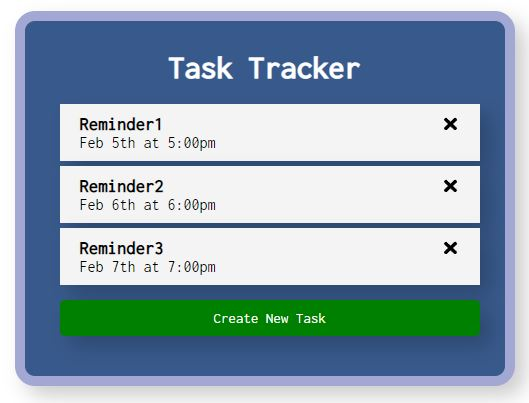
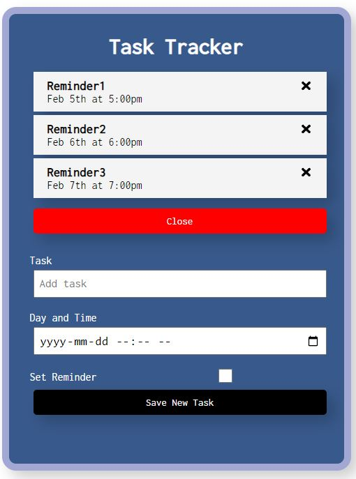

<div id="badges" align="center">
  
  
</div>

# Task Scheduler Front-end

React.js Front-end for a simple scheduling app

### Languages and Tools


<div align="center">
  &nbsp;
  &nbsp;
  &nbsp;
  &nbsp;
  &nbsp;
  &nbsp;
</div>

## Installation

Install my-project with npm

```bash
  npm install
  cd to-do-react
```

## Demo

Check demo at https://fabio-writes-code.github.io/to-do-react/





## Contributing

Contributions are always welcome!

Please adhere to this project's `code of conduct`.
